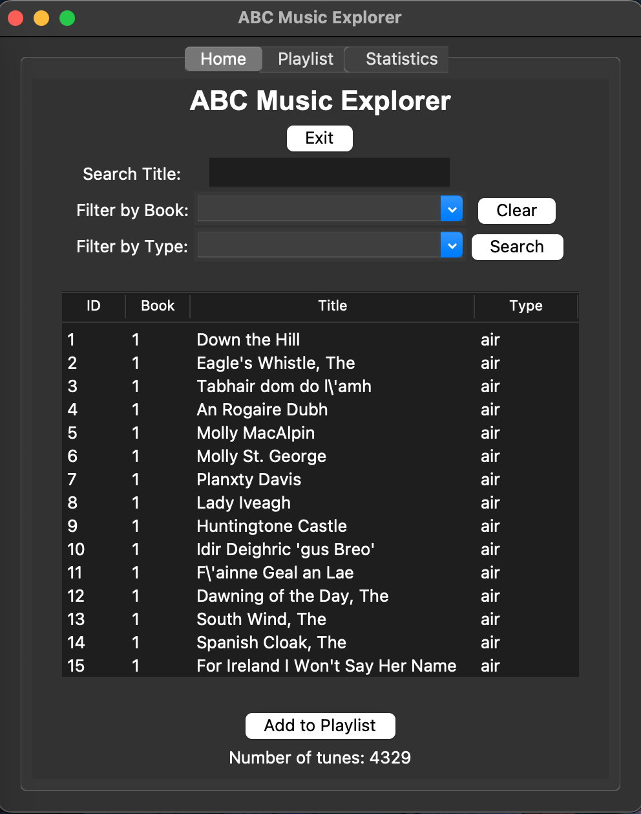
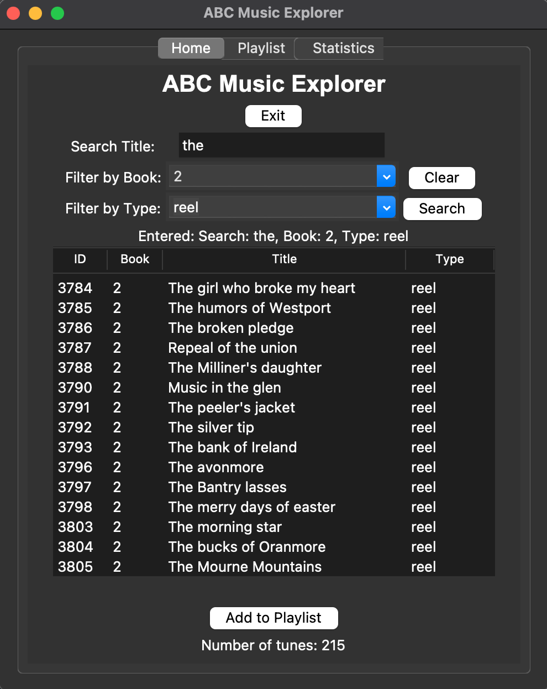
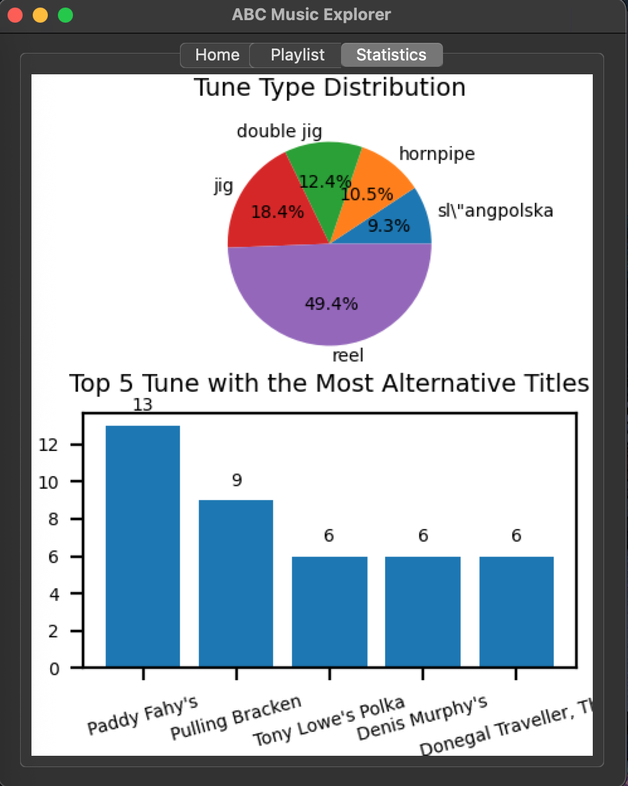

# Data Centric Programming Assignment 2025

# ABC Music Database Explorer

- A Traditional Irish Music Database Explorer built with Python, MySQL (Database) and Tkinter (UI)

Name: Lok Ching Tam

Student Number: C24385243

Class Group: TU850 Data Science & AI

# Screenshots
- Home Page


- Search Page


- Playlist Page


- Statistics Page


# Description of the project
This is a Tkinter-based program that provides interactive user interface for users to explore tunes. Users can search, add their favourite tunes into playlist, export playlist as CSV file, and view plots generated from the tunes data.

# Instructions for use
## 1. Clone this repository (`abc-music-explorer`)
```bash
git clone https://github.com/lokChingt/abc-music-explorer.git
```

## 2. Install package requirements
```bash
pip install requirements.txt
```

## 3. Create database and tables for `tunes` and `tune_alt_titles`
- Run SQL script `src/create_tables.sql`

## 4. Parse and Insert tunes from `abc_books` folder to database
- Run Python script
```python
python src/parse_insert_db.py
```
- `"Parsed and Inserted into the Database Successfully"` will be printed if success

## 5. Activate Tkinter
- Run Python script
```python
python src/tk_viewer.py
```

## 6. You are good to go!

***Step 1 - 5 only need to run once** <br>
***Just need to do step 5 everytime you use ABC Music Explorer**

# How it works:
## 0. Activate Tkinter (View all tunes)
```python
python src/tk_viewer.py
```
- All tunes will be shown in the table with 15 rows
- You can scroll down for more
- The totel number of tunes will be show below the table 

## 1. Search
- Input search word and/or choose book number and/or choose tune type
- Click Search button on the right side
- Search result will be shown in the table
- The totel number of searched tunes will be show below the table

## 2. Clear search inputs
- Click Clear button on the right side

## 3. Add tune(s) to playlist
- Click any row in the table
- If you want to multi-select, press command for mac or ctrl for windows, then click any rows
- After selecting all wanted tunes, click the Add to Playlist button below the table
- A message of "Added successfully" will be shown above the button

## 4. View Playlist
- Click the second tab (Playlist) at the top of the window
- All added tunes will be shown in the table with 20 rows
- You can scroll down for more

## 5. Remove tune(s) from playlist
- Click any row in the table
- If you want to multi-select, press command for mac or ctrl for windows, then click any rows
- After selecting all wanted tunes, click the Remove button below the table
- A message of "Removed successfully" will be shown above the button

## 6. Clear all tunes from playlist
- Simply click the Clear button below the table

## 7. Save Playlist as CSV file
- After adding all your tunes into the playlist, click the Save as CSV button
- A file dialog will pop up, then you can choose where you want to save the CSV file and click save

## 8. View Statistics
- Click the third tab (Statistics) at the top of the window
- Two charts will be shown below
- Top one is a pie chart shows the Top 5 Most Used Tune Type
- Button one is a bar chart shows the Top 5 Tune with the Most Alternative Titles

## 9. Exit Program
- If you are in the first tab (Home), click the Exit button below the title
- If you are in other tab, click and switch to the first tab (Home), then click the Exit button
- It will close the entire program
- If you wish to open it again, activate it by running `python src/tk_viewer.py`

**NOTICE: The tune playlist will be clear and reset every the program is closed**

# List of files in the project

| Files | Description |
|-----------|-----------|
| requirements.txt | List of required packages |
| create_tables.sql | Create tables for tunes and tune_alt_titles |
| parse_insert_db.py | Parse tunes from abc_books folder & insert into database |
| tk_viewer.py | Tkinter to interact with user |

# References

* [Use Pathlib to get tune files](https://www.geeksforgeeks.org/python/pathlib-module-in-python/)
* [Embed Matpltlib into Tkinter](https://www.geeksforgeeks.org/python/how-to-embed-matplotlib-charts-in-tkinter-gui/)

# What I am most proud of in the assignment

- When selecting the tune(s), you can click anywhere outside the table to deselect the tune(s)
- Add/remove/save messages only appears for 1 second after the buttons are clicked, to make the interface simple and clean and avoid confusion


# What I learned

- Parse ABC files
- Connect & Insert into the database
- Create Tkinter GUI to display the tunes
- Filter the tunes using SQL queries
- Export tune playlist as CSV file
- Create and display plots using Matplotlib